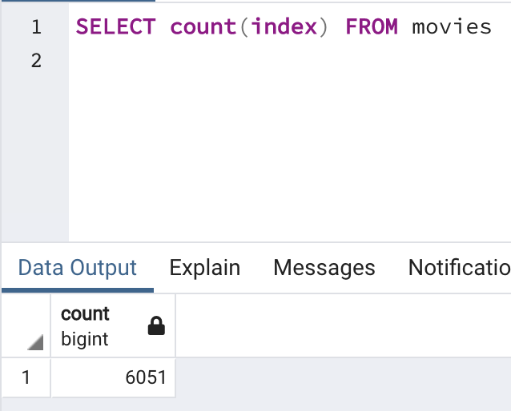
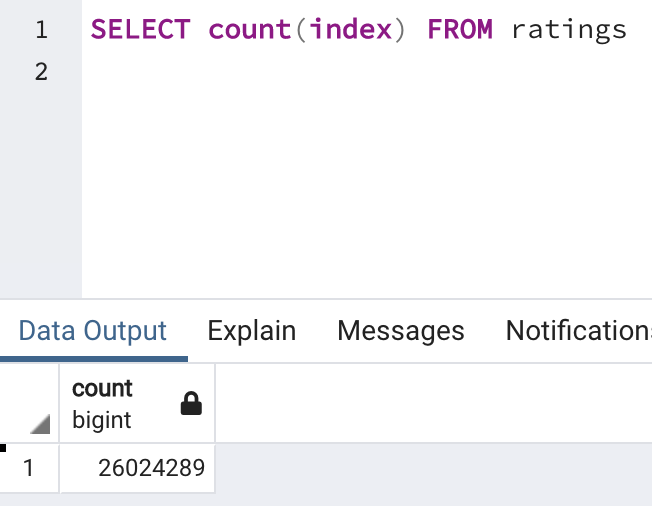

# Movies-ETL

# Overview

The following script performs an **Extract, Transform, Load (ETL)** process, combining data from Wikipedia and Kaggle, cleaning and joining the data, and saving this new dataset to a SQL database.

There are four scripts representing successive iterations to build the final ETL script. The files are as follows:

- ETL_function_test.ipynb
- ETL_clean_wiki_movies.ipynb
- ETL_clean_kaggle_data.ipynb
- ETL_create_database.ipynb

The final script contained two functions:
- **clean_movie(movie)**: This function is used to iterate through a DataFrame to collect and condense alternate movie titles, as well as clean up column names.
- **extract_transform_load()**: This function is passed three datasets; `wikipedia-movies.json`, `movies_metadata.csv`,and `ratings.csv`. From here, the script performs a long series of data cleaning, joining, and finally adds tables to a SQL database.

### Screenshots

After adding the datasets to a postgres database, the following queries were run to confirm the data was added correctly:

